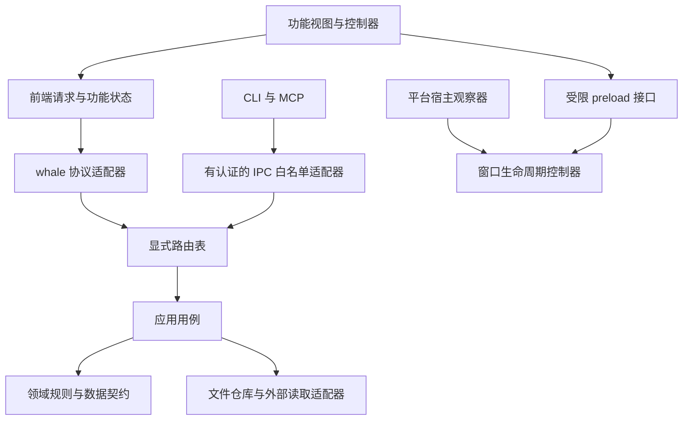

# 架构审阅与渐进重构方案

审阅日期：2026-10-09。基线：`main` / `c799866d38392e52cd464156cfaaa69cce16e4b2`，构建标识 `0.3.0+codex.20261009-bubble-open-refresh`。

实施状态：阶段 0–2 已于同日完成，当前验收与指标见 [重构阶段 0–2 基线与验收记录](REFACTOR-BASELINE.md)。阶段 3–6 仍是后续计划。

## 1. 结论与范围

**建议重构，优先解决前端共享状态、隐式调用和重复基础设施，采用逐项替换的方式。** 当前项目能够运行，也已积累针对真实问题的回归测试；主要维护负担来自大型闭包持续增加功能，外围模块通过全局变量、DOM 和事件继续接入，以及新旧数据访问方式并存。

本方案以保持现有用户行为、数据和 Windows/macOS 兼容路径为前提。推荐继续使用 Electron 和本地 IPC，先以原生 JavaScript 模块及明确接口完成拆分。首轮不需要同时更换 UI 框架、引入数据库或改成网络服务。类型约束先覆盖跨模块契约；若后续使用 TypeScript，按已拆出的模块逐步迁移。

最初审阅核查了主要入口、前端加载关系、资源路由、计费与会话链路、持久化、窗口生命周期以及测试和发布脚本。随后按本方案完成前三阶段；下文的规模基线仍表示重构前提交，不能当成当前文件规模。

### 可复核的规模基线

统计范围为 `assets/`、`desktop/`、`runtime/`、`lib/`、`scripts/` 下的 `.js/.mjs/.cjs`；行数包含空行，排除 `tests/`、`archive/`、`vendor/`。

| 指标 | 当前值 | 意义 |
| --- | ---: | --- |
| 上述 JavaScript 总行数 | 20,305 | 用于比较重构前后结构，不作为删代码目标 |
| `assets/whale-widget.js` | 12,189 行 | 约占上述代码的 60%；主要代码处在 `dshwInit()` 闭包 |
| `lib/widget-host.mjs` | 1,201 行 | 资源存取、配置处理和请求处理集中在同一模块 |
| `runtime/service.mjs` | 471 行 | 包含余额查询、任务结算、恢复、设置和通知等职责 |
| `desktop/main.cjs` | 438 行 | 负责装配，并直接管理窗口、IPC、模式、恢复和部分存储 |
| 页面加载的经典脚本 | 19 个 | `defer` 保证顺序，但模块依赖主要依靠约定 |
| 默认 Node 测试文件 | 37 个 | `npm test` 只匹配 `tests/*.test.mjs` |

同一提交在本次审阅前的安装验证中已通过 **263 项测试**。这个结果作为既有基线，不能推导出全部桌面交互或 macOS 已通过。本轮未重跑桌面 GUI 回归，也没有测量 CPU、内存或帧耗时。

## 2. 主要发现及证据

这里的优先级表示重构顺序，不表示发现了同等级的运行故障。

### A. 前端的模块边界不完整——最高优先级

**证据：** [挂件闭包与分段索引](../assets/whale-widget.js#L30)覆盖菜单、任务音效、用量面板、资源管理、气泡默认内容、编辑器、渲染、保存与拖拽。外部模块经 `WhaleAccountView`、`WhaleFeedback`、`WhaleQuota` 等全局接口连接；[页面入口](../desktop/ui/widget.html#L5)手工维护 19 个脚本的加载顺序。

更具体的问题在[音效面板初始化](../desktop/ui/sound-settings.js#L43)：代码按中文标签查找旧菜单行、隐藏这些行，再定位旧按钮；[打开音频编辑器](../desktop/ui/sound-settings.js#L288)调用旧按钮的 `.click()`，并观察旧弹层的 `style` 来判断编辑完成。更改文案、标题、DOM 层级或关闭方式都可能破坏这个连接，即使业务逻辑完全没有变化。

**建议：** 功能通过 `open()`、`save()`、`subscribe()`、`dispose()` 等显式接口协作。旧闭包只通过一个临时适配器接入新模块。依次建立功能自身的状态归属，再迁出代码；不把整个闭包变量集合装进一个共享 `context` 对象后分发给所有文件。

### B. 设置的归属和提交边界分散——最高优先级

**证据一：** [renderer 定期保存](../desktop/ui/input.js#L120)每 800 毫秒检查 localStorage 快照，经 preload 和主进程交给 [UiStateStore](../desktop/ui-state-store.cjs#L3)。同时，[dispatcher](../runtime/dispatcher.mjs#L115)保留了对同一个 `ui-state.json` 的直接读写路由，主进程则持有自己的内存副本。

仓库检索只发现该路由的定义，未发现现有调用方。因此，这是**潜在的第二写入入口与后续扩展风险**，不是本次已复现的覆盖故障。localStorage、内存缓存和文件也不是天然错误的重复；需要明确谁拥有最终状态，以及何时确认保存成功。

**证据二：** [音效保存](../desktop/ui/sound-settings.js#L207)同时涉及 size 配置和 usage 配置。浏览器先写一份，再写另一份，第二次失败时尝试补偿第一份。补偿发生在 renderer，窗口退出或进程中断会使恢复依赖调用时序。

**建议：** 每类数据明确一个写入负责人。UI 偏好由主进程提供有确认结果的存储接口；音效提交交给后端应用层协调，UI 只提交一份草稿。先保留现有文件格式，增加版本检查与可恢复的多文件提交流程；随后才评估是否合并数据文件。

### C. 基础操作存在真实重复，且语义已经不同——高优先级

| 重复位置 | 已观察到的差异 | 建议抽取的边界 |
| --- | --- | --- |
| [client 请求封装](../desktop/ui/client.js#L9)、[API 模型请求封装](../desktop/ui/api-models.js#L5)、[音效请求封装](../desktop/ui/sound-settings.js#L6) | 前者只判断业务 `ok`，后两者同时判断 HTTP 状态；错误处理分散 | 一个 renderer 请求客户端，保留各功能自己的业务解释 |
| [余额响应读取](../runtime/providers.mjs#L7)、[模型响应读取](../runtime/api-models.mjs#L132)、[汇率响应读取](../runtime/fx.mjs#L31) | 字节上限、取消方式、无流响应处理不同 | 共享受限读取与取消原语，按调用方传入限制和策略 |
| [通用 JSON 写入](../runtime/paths.mjs#L20)、[资源写入](../lib/resource-store.mjs#L28)、[UI 状态写入](../desktop/ui-state-store.cjs#L23)、[主进程 save](../desktop/main.cjs#L53) | Windows 重试、备份、flush、串行队列、错误传播各不相同 | 统一文件替换机制，保留领域仓库的备份与事务策略 |
| [音效地址解析](../desktop/ui/sound-settings.js#L33)、[等待提示音效解析](../desktop/ui/wait-notice.js#L12) | 存在相同的 `grp:` / `frag:` / `preset:` 解析 | 共享声音引用格式与解析函数 |

这里应复用机制，保留策略差异。例如汇率请求不需要凭据，余额请求需要专门的认证和错误分类；不能用一个宽松封装覆盖全部情况。同步写入、异步排队和跨文件事务也不能仅靠同一个 `writeJson()` 名字替代。

### D. 本地资源请求还承担历史 Web 插件适配成本——高优先级

**证据：** [dispatcher 装配](../runtime/dispatcher.mjs#L32)构造虚拟 `webServer.register` / `tapIndex`，供 [widget host](../lib/widget-host.mjs#L131)注册旧式处理器；请求再被转换成 `Readable` 和 `Writable` 模拟对象，收集响应字节后返回，见 [请求适配](../runtime/dispatcher.mjs#L144)。项目实际没有 HTTP 监听端口。

**影响：** 新功能既可能写在 dispatcher 的路径分支中，也可能写成旧式 `req/res` handler。方法检查、错误格式、正文解析和资源返回有两套写法。

**建议：** 统一为直接返回结果的处理器，并让 Electron 协议适配器、外部 IPC 适配器分别调用。保留已有 URL 作为兼容契约，按资源类别逐个替换旧 handler，最后删除模拟流桥接。旧路由名称本身不必为了目录整洁而改掉。

### E. 计费服务和会话读取需要更清晰的职责边界——中高优先级

**证据：** [WhaleService 构造与状态](../runtime/service.mjs#L9)同时维护余额缓存、并发查询、活动轮次、结算任务、恢复日志、待确认消费和通知定时器。`getBalance()`、`settleTurn()`、`prepareRecovery()`、`queueNotice()` 等属于不同职责，但共享该对象的可变状态。[SessionMonitor](../runtime/session-monitor.mjs#L243)直接调用这些方法，其状态查询还读取服务内部的 `turns` 和 `journal`。

[SessionReader/SessionParser](../runtime/session-monitor.mjs#L13)与 [InsightAccumulator/collectInsights](../runtime/insights-worker.mjs#L28)都解析会话计数与元数据。它们的用途不同：前者负责实时轮次及恢复，后者负责有扫描预算的历史滚动统计，且包含归档目录。不能直接把其中一个删除或完全复用前者的账本作为后者的统计来源。

**建议：** 保留 `WhaleService` 门面，逐步抽出余额查询、轮次结算/恢复和通知发布三个组件。对外暴露只读状态方法。先共享经过测试的事件解码、身份识别和计数规范化，再分别保留实时投影与历史投影。将 parser/reader 从持有 Worker 的宿主模块分出，使 worker 入口不必导入宿主编排模块。

### F. 测试有价值，但一部分绑定了源码布局——高优先级的实施前提

**证据：** [菜单悬停测试](../tests/menu-hover.test.mjs#L7)、[启动恢复测试](../tests/startup-show.test.mjs#L6)、[桌面模式测试](../tests/desktop-mode.test.mjs#L41)通过 `indexOf()` / `slice()` 截取源码，再放进 VM 执行。改函数位置或名称会影响测试装配。这些测试保护的行为仍然重要，需要在提取模块时改为调用真实导出接口。

[当前 CI](../.github/workflows/verify.yml)执行默认 Node 测试及发布包检查；仓库已有的 [桌面功能回归](../tests/feature-ui-regression.mjs)和[渲染回归](../tests/render-regression.mjs)不由 `npm test` 的文件匹配直接执行。现有证据不能等同于所有桌面路径都受 CI 保护。

**建议：** 继续保留领域与故障注入测试；被迁移模块的源码截取测试同步改造。把可稳定自动运行的 Electron 测试加入明确入口。窗口遮挡、原生穿透、睡眠唤醒等保留真实桌面的验收门槛，不以 headless 或普通 CI 结果代替。

### G. 退役实现与文档、打包规则存在漂移——中优先级

**证据：** [产品决定](DASHBOARD-B.md)明确说明 B 版面板已撤下，页面入口也不加载 `dashboard.js`；但 [包检查](../scripts/check-package.mjs)和[发布构建](../scripts/build-release.py)仍要求它存在，旧闭包还保留对 `WhaleDashboard` 的条件分支。

另有小型遗留项：`widget-host.mjs` 中的 `balanceInFlight`、`USAGE_FILE_CANDIDATES`、`TURN_FILE_CANDIDATES` 没有后续使用；`balanceCache` 只被初始化或清空。删除前仍应核对全部调用和发布要求。

[被索引为权威的数据口径说明](V0.3-PLAN-AND-PROVENANCE.md)保留了扫描上限 256 文件 / 128 MiB 的描述；[当前历史扫描实现](../runtime/insights-worker.mjs#L56)默认是 400 文件 / 96 MiB，并已有 app-server 直读优先、会话快照回退的实现。当前规格与历史说明应明确区分。

**建议：** 为退役代码做可达性清单，再同步删除加载分支、文件和包规则。将运行资源清单作为检查与构建的共同输入；更新当前行为说明，保留有价值的历史背景和来源署名。

## 3. 应当保留并继续利用的设计

- 本地 IPC 与自定义协议、CSP、preload 隔离、外部命令白名单和凭据目标约束已有明确边界。
- `ledger.mjs`、`turn-journal.mjs`、`resource-store.mjs` 已有账本去重、恢复或写入失败保护，配有回归测试；迁移时优先复用现有行为。
- `visibility.cjs`、`lifecycle.cjs`、`window-shape.cjs` 已将部分窗口策略独立出来，并支持注入依赖或单独测试。
- `money.js`、`turn-notice.js`、`render.js` 已有可提取接口，不必重写所有前端能力。
- API 模板在后端有集中定义，前端读取后端提供的列表。这里不是两份重复模板。
- 原生命中测试、动画、定时刷新和隐藏恢复有各自职责。定时器与观察器数量只提示需要检查生命周期，不能据此认定存在性能故障。

## 4. 目标结构与依赖规则

目标是一个边界清楚的本地应用，应用服务仍运行在现有进程内，不增加独立网络服务。以下目录按阶段形成；现有入口与路径先保留为转发层。

```text
shared/contracts/             请求、结果、事件、设置版本的纯数据契约
runtime/
  application/                余额查询、轮次结算、通知、音效设置等用例
  domain/                     金额与计数规则、结算规则、会话事件解码
  infrastructure/             JSON/资源仓库、受限网络读取、会话文件读取
  transport/                  路由注册、结果转换、外部 IPC 适配
  dispatcher.mjs              装配入口，迁移期维持原导出
  service.mjs                 迁移期门面
desktop/
  main.cjs                    Electron 装配、启动与退出
  platform/                   Windows/macOS 的宿主窗口适配
  ui/
    app/                      明确的启动顺序与销毁
    services/                 请求、状态存储、查询缓存、音频
    components/               选择器、弹层、菜单等通用控件
    features/                 账户、提示音、角色、气泡、用量、工坊
    legacy/                   临时闭包适配器，逐阶段收缩
assets/                       图片与声音；旧脚本在迁移完成后退出
```



依赖规则：

1. 领域规则不访问 DOM、Electron、文件系统或真实网络；需要时间时传入时钟。
2. 功能视图通过控制器操作自身状态，不读取别的功能的闭包变量、文案或内部 DOM。
3. `shared/contracts` 只放跨边界的数据定义和校验，保持浏览器可用；不成为万能工具目录，不包含凭据。
4. preload 暴露的 `whaleDesktop` 是有意保留的安全边界。普通 UI 模块改用 import；迁移期 `window.Whale*` 只在适配器内维护。
5. renderer、CLI/MCP、supervisor 的允许操作分别声明。共享路由实现不意味着把所有 UI 路由开放给外部 IPC。
6. 每个查询、订阅、监听器和定时任务有负责人及清理接口。显示倒计时与网络刷新分开；不要求所有计时器共用一个调度器。
7. 新增目录、模块入口、worker 资源要同步更新发布清单、自定义协议资源映射和解压后运行检查。禁止把请求路径直接映射到任意文件系统路径。

### 数据归属建议

| 数据 | 最终负责人 | UI 的职责 |
| --- | --- | --- |
| API 配置、凭据解析 | ConfigStore / 配置应用接口 | 展示脱敏 DTO，提交增量修改 |
| 显示模式、偏好 | 设置仓库 | 维护快照，等待提交确认后更新 |
| 音效与提示设置 | SoundSettings 应用接口 | 编辑草稿、取消、提交、展示错误 |
| API 余额、订阅窗口、本机 token | 各自查询服务与明确的数据类型 | 按来源展示，保留未知/过期/不完整状态 |
| 账本与恢复日志 | 结算应用层及对应仓库 | 只读查询或显式校正命令 |
| 气泡场景、当前弹层、拖拽进度 | 对应功能控制器 | 短期交互状态，不自动全部持久化 |
| 素材文件与索引 | 资源仓库及导入/删除用例 | 提交操作、显示结果 |

## 5. 分阶段实施

建议每个阶段分成可独立回退的小 PR。避免在同一 PR 内同时更改文件结构、业务规则、数据格式和平台行为。下面是依赖顺序，工作量应在第一条试点完成后再估算。

### 阶段 0：固定行为与验收入口（已完成）

**交付：** 当前路由/事件/存储归属表、合成历史数据样本、GUI 回归启动方式和性能基线记录方式。

整理的重点是确认已有行为，而不是复制实现再写一套测试。复用已有测试，补足后续拆分将触及的边界：保存后重启、取消草稿、快速切换后旧请求返回、重复任务事件、数据迁移失败恢复。

**门槛：** 默认测试和包检查通过；记录代表性桌面场景的预期结果。基线数据全部合成。没有当前性能测量时，不在方案或提交中承诺性能提升比例。

### 阶段 1：建立模块入口和最小契约（已完成）

**交付：** renderer 请求客户端、声音引用解析、基础 DTO/错误码、显式启动与销毁接口、临时 legacy 适配器。

- 请求客户端统一检查 HTTP 状态、业务失败、超时和取消；重试策略由用例决定，写入与导入操作不能自动盲重试。
- 新模块用 ESM，通过明确启动顺序提供旧脚本需要的依赖；先验证兼容启动，再逐步减少经典脚本标签。不是直接把旧文件改成 `type="module"`。
- 依赖约束先覆盖新模块；新增全局变量和绕过契约的调用进入检查。类型说明可以先用 JSDoc，逐步启用检查。

**门槛：** 正常启动、重载、初始化失败和销毁可测试；现有 UI 入口仍可达；新模块不依赖旧代码内部变量。纯机械格式化与行为变动分开审阅。

### 阶段 2：以“音效与提示”完成第一个纵向迁移（已完成）

**交付：** 独立音效设置视图与控制器、明确的 `audioEditor.open()` 接口、后端保存用例及版本检查。

- 从“查中文标签 → 隐藏旧行 → 点旧按钮 → 观察样式”改为显式菜单注册与编辑器完成/取消结果。
- 音效地址、音量继承和播放通道规则集中管理；音频剪辑预览与按压/任务提示可以保持不同播放策略。
- 草稿提交交给后端协调，保持旧数据文件兼容；采用持久化的事务记录和启动恢复处理多文件更新。普通单文件原子替换不能声称提供多文件事务。
- 在旧入口切换到新控制器并通过验收后，删除对应旧实现；不要长期保留两套可写设置入口。

**门槛：** 保存、取消、Esc、试听、静音、音量继承、导入音频、重启保持设置通过；对第二文件写入失败、补偿失败和中途终止注入故障，恢复后得到明确的一致状态。手工核对菜单位置与原有交互。

这是首轮最值得落地的范围：它同时验证前端拆分、模块调用、状态归属和后端提交边界，风险比直接改写整个气泡编辑器更容易限定。

### 阶段 3：整理基础设施及资源路由

**交付：** 共享受限响应读取、文件替换机制、资源仓库、显式路由表，以及逐项缩小的旧 handler 适配器。

- 优先迁移声音、角色、气泡图片，再迁移其他旧资源路由。
- 每个新 handler 接收结构化请求并返回结构化结果；请求校验、错误分类和结果序列化集中处理。
- JSON 仓库保留各自备份、只读损坏状态、容量限制和失败恢复策略。同步/异步实现可以保留差异，但要共享一致的策略与测试要求。
- 明确 `ui-state.json` 的唯一写入负责人；确认无受支持调用后移除重复路由，或使其转发到同一仓库。
- 新路由表显式声明方法、正文限制、结果类型与访问范围；迁移期保留旧 URL 和响应兼容测试。

**门槛：** 路由契约逐项匹配；错误不泄露凭据或原始响应；导入、删除、损坏索引、空间不足和路径越界测试通过；最终可删除 `req/res` 模拟流，无须修改外部调用方式。

### 阶段 4：分解旧前端主体

按依赖较少到较多的顺序提取：

1. 默认配置、模板解析、格式化等纯逻辑。
2. 选择器、弹层和菜单基础控件；保留 CSS 类名以降低样式与命中测试变化。
3. 角色、音频、气泡图片与工坊操作。
4. 气泡队列/场景控制、内容构建与已有 BubbleRenderer 的调用边界。
5. 气泡编辑器：草稿模型 → 编辑命令 → 编辑视图。
6. 用量面板与图表，最后整理人物交互和拖拽锚点。

每迁出一个功能，旧闭包调用新模块的公开接口，随后删除迁出的重复实现。先让纯规则可直接测试，再拆操作 DOM 的部分。默认素材和内容可以很长，长度本身不要求拆散数据。

**门槛：** 对应行为测试调用实际模块，不再依赖源码截取；气泡淡出、快速重开、随机选择、金额精度、角色图片命中和菜单边界无回归。最终旧入口只保留装配；单个逻辑模块超过约 500 行时需要说明职责，行数不是硬性通过条件。

### 阶段 5：分解服务编排并整理平台边界

**交付：** `BalanceQuery`、`TurnAccounting`、`NoticePublisher`，只读监测状态接口，以及共享的会话事件解码模块。

- 先用现有 WhaleService 方法保持外部兼容，分别迁移缓存与查询、结算/恢复、通知去重与等待状态。
- 领域逻辑显式接收时钟和依赖，账本和恢复记录先保持格式不变。
- 实时与历史读取分别保留扫描范围、预算、不完整标志、归档处理和恢复语义；共享经过相同样本验证的规范化规则。
- 最后整理 `main.cjs` 的装配与窗口控制，并将 Win32/Swift、supervisor 输出转换到统一宿主状态契约。保留平台能力差异与现有可见性控制器。

**门槛：** 并发/乱序余额、跨日、父子任务去重、延迟扣费、取消覆盖失败、崩溃恢复测试通过；历史统计的计数、来源和不完整标记与基线一致。Windows 验收跟随、最小化恢复、模式切换、弹框和穿透；涉及 Mac 路径的变更在 Mac 实机完成验收后才计为该平台完成。

### 阶段 6：删除兼容层并形成持续维护门槛

**交付：** 删除已不可达实现、整理包资源清单、更新当前规格和开发入口，新增类型/依赖检查与稳定的桌面回归入口。

删除 `dashboard.js` 等退役实现时，同步修改包检查、条件分支和文档。删除兼容层前必须证明调用方已迁完。将临时旧接口与旧数据支持期限写明，避免重构又永久增加一套实现。

**门槛：** 从发行包解压后的入口可运行；安装、更新、回滚均验证；新功能能在所属模块内完成主要修改；当前规格中的接口、扫描预算和数据来源与实现一致。

## 6. 必须保持的行为与验证方式

| 边界 | 必须保持 | 验证方式 |
| --- | --- | --- |
| 数值口径 | API 金额、订阅比例、本机 token 各自独立；未知不变成零 | 合成数据契约与领域测试 |
| 计费 | 固定精度、重充/跨日/乱序、父子去重和待确认状态 | 现有账本与恢复测试，加迁移所需样本 |
| 用户提示 | 主任务提示去重；取消/失败语义；打开额度气泡强制刷新 | 通知测试和真实 renderer 场景 |
| 设置 | 草稿取消无副作用；保存有确认；旧配置与素材可用 | 失败注入、重启和迁移测试 |
| 桌面 | 隐藏意图、最小化/恢复、透明穿透、动画关闭过程 | 可见性测试加真实窗口回归 |
| 产品决定 | 紧凑菜单、现有关闭方式，不加入全局空白点击关闭 | 对照现有产品文档和用户测试清单 |
| 边界控制 | 无新增 HTTP 监听，IPC 权限不扩大，原生消息校验保留 | transport/security 测试和路由访问矩阵 |
| 发布 | 安装、资源映射、worker 路径、备份和回滚有效 | 包检查与独立数据目录中的安装验收 |

每个 PR 跑相关测试，并完成仓库要求的默认测试与发布检查。只有新变动或未解决风险需要时才扩大验证范围。GUI 与平台验收单独记录结果，不能以总测试数量替代。

性能验收先在同一机器、同一合成数据与同一窗口场景上记录基线：冷启动到角色可交互、打开额度气泡的请求数与延迟、闲置/隐藏时的 CPU 与任务数、菜单/编辑器关闭后的监听器和绑定数。出现回归时再定位，不先承诺百分比目标。

## 7. 数据兼容与回滚

1. 前几阶段先保持已有配置、账本和素材格式；目录移动不顺带改变数据格式。
2. 所有写入口收敛之后，再引入需要的新 schema 版本。迁移在合成/隔离数据目录先验证，记录版本与完成状态，并可重复安全执行。
3. 跨文件保存使用可恢复事务记录；单文件写入失败、进程中断、重复恢复都必须得到确定结果。未确认提交前不向 UI 宣布保存成功。
4. 每个小阶段保留前一版代码和有效安装回执。代码回退与数据回退分别设计。
5. 若新 schema 不能被旧版读取，旧安装器“保留当前数据”的回滚不足以恢复兼容；该阶段必须同时提供兼容读取、逆向迁移或明确的数据备份恢复流程，不能默认一次 Git 回退就足够。
6. `archive/`、第三方来源、原素材许可和 macOS PR #128 的署名继续保留。

## 8. 完成标准与建议的第一批工作

完成标准以维护成本和边界为准：

- 新增一种提示事件，不需要修改大型闭包、按中文找控件或模拟旧按钮点击。
- 新增资源操作只改领域用例与路由注册，不再复制请求流模拟和持久化错误处理。
- 一个设置字段只有一个最终写入负责人；查询结果明确区分来源、未知和过期。
- 主要规则能直接导入测试；常规模块移动不会使测试因源码字符串位置变化而失效。
- 前端以显式模块依赖启动；全局业务接口仅在迁移期存在，preload 安全接口独立保留。
- 发行包检查基于真实运行资源；删除退役功能不再被无关硬编码清单阻止。

**第一批建议实施阶段 0–2：建立验收基线与最小接口，并完成音效与提示的完整迁移。** 达到这批门槛后，再根据实际改动规模和回归成本细化后续 PR。优先证明新的边界能让一次功能修改更集中、更容易测试，再推广到气泡编辑器和计费链路。
